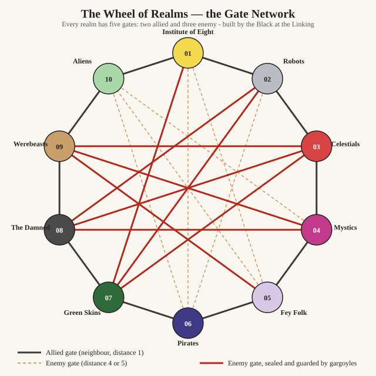

---
tags:
  - game-mechanic
topics: []
status: seed
created: 2026-08-08
updated: 2026-09-09
sources:
  - Raw/Sources/interviews/faction-eleven-lore-and-design.md
source_count: 1
aliases:
  - Reality Nearness
  - Nearness
  - The Gate Network
state: concept
category: traversal
features: []
related_mechanics:
  - exploration-core-loop
---

# Realm Nearness And Traversal

Ten realms, and a fixed ring of **twenty-five static gates** between them. There is no cycle, no
weather, nothing that fluctuates: which two realms a gate joins never changes. "Nearness" is just
the two categories a gate can be — **allied** (a realm's two neighbours) or **enemy** (the three
realms at distance 4-5) — not a quality that rises or falls over time.

**State:** concept · **Category:** traversal

**Implemented by:** _(no feature notes yet)_

## The Gate Network

**[[tezcatlipoca-the-black]] built it, once, at [[the-linking-of-the-realms]].** Every realm was wired
to exactly five others — never four, never six — following one rule:

| Ring distance | Relationship | Gate? |
|---|---|---|
| **1** | neighbour, historically **allied** | **Yes** |
| 2 | — | No |
| 3 | — | No |
| **4** | historically **enemy** | **Yes** |
| **5** | the direct opposite, historically **enemy** | **Yes** |

**Two allied gates, three enemy gates, always.** A realm's two neighbours (distance 1, either
direction round the ring) are its allies. The three realms sitting at distance 4 and 5 — one
direction-4 neighbour, the exact opposite, and the other direction-4 neighbour — are its enemies.
Realms at distance 2 or 3 have **no gate at all**. This is the entire rule, and it produces exactly
ten allied gates (the ring itself) and fifteen enemy gates, for twenty-five in total — every realm
touches five others and is unreachable by gate from the remaining four.

**This corrects [[sealed-interplane-gates]]'s old account.** That note described nearness loosely as
"gates connect realms that are close," with distant realms flatly impossible. The real rule is
stranger and more precise: the *closest* relationship (distance 1) and the *three farthest*
(distance 4-5) both get gates; the realms in between (distance 2-3) get nothing. Near does not mean
compatible; **allied or enemy** means compatible.

### The Diagram

The ring is the ten allied gates. The crossing lines are the fifteen enemy gates — three of them
(thick, solid) are the ones that also carry a gargoyle-built barrier from the old war
([[the-realm-barriers]]); the other twelve are plain, sealed Ancient gates that have never been
dramatised.

### Full Table

| Realm | Allied gates (2) | Enemy gates (3) |
|---|---|---|
| 01 [[institute-of-eight]] | [[realm-10]], [[realm-02]] | [[realm-05]], [[realm-06]], **[[realm-07]]** |
| 02 [[robots]] | [[realm-01]], [[realm-03]] | [[realm-06]], **[[realm-07]]**, [[realm-08]] |
| 03 [[celestials]] | [[realm-02]], [[realm-04]] | **[[realm-07]]**, [[realm-08]], [[realm-09]] |
| 04 [[mystics]] | [[realm-03]], [[realm-05]] | **[[realm-08]]**, [[realm-09]], [[realm-10]] |
| 05 [[fey-folk]] | [[realm-04]], [[realm-06]] | **[[realm-09]]**, [[realm-10]], [[realm-01]] |
| 06 [[pirates]] | [[realm-05]], [[realm-07]] | [[realm-10]], [[realm-01]], [[realm-02]] |
| 07 [[green-skins]] | [[realm-06]], [[realm-08]] | **[[realm-01]]**, [[realm-02]], **[[realm-03]]** |
| 08 [[the-damned]] | [[realm-07]], [[realm-09]] | [[realm-02]], [[realm-03]], **[[realm-04]]** |
| 09 [[werebeasts]] | [[realm-08]], [[realm-10]] | [[realm-03]], **[[realm-04]]**, **[[realm-05]]** |
| 10 [[aliens]] | [[realm-09]], [[realm-01]] | [[realm-04]], [[realm-05]], [[realm-06]] |

**Bold** marks the three barrier-carrying enemy pairs (07↔03, 08↔04, 09↔05) — the ones the old war
was actually fought through.

### Two Layers Of State, On Top Of A Fixed Existence

**Whether a gate exists is fixed forever.** Whether it is *passable* is not, and that is tracked in
two independent layers:

1. **The seal** (the Black's/Ancients' layer). **All twenty-five gates were sealed at once** by
   [[the-long-disconnection]]. The only thing that unseals one is [[xipe-totec-the-red]]'s power,
   exercised by [[val]] or [[ninja]] — which is why most of the network is still sealed and dark, and
   the handful of open or cracked gates in the material are the exceptions, not the rule.
2. **The barrier** (the gargoyles' layer, [[the-realm-barriers]]), which exists **only** on the three
   old-war gates (07↔03, 08↔04, 09↔05). Breaking it is a second, separate act from unsealing the
   gate underneath — [[the-guardians-of-night]] broke barriers; they did not use Red Power to do it.

**A gate's existence never needed a story reason. Its current state always does.** Every dramatised
gate in the material now reads as one specific state on top of a network that was always there:

- [[the-gate-guardian]]'s gate (01↔02, allied) — sealed, then **guarded** on top, by
  [[quetzalcoatl-the-white]].
- [[the-ancient-ruin]]'s gate (01↔07, **enemy**, distance 4) — **abandoned and cracked**. It is one
  of Institute's three enemy gates, not an anomaly: the Institute guards the ally it fears might turn
  and has simply neglected the enemy gate nobody was watching. That neglect is why [[ninja]] gets
  through it at all.
- The Damned's gate to the Green Skins (08↔07, allied) — **unsealed by Red Power**, [[val]]'s.
- The Celestials' gates to the Green Skins and the Werebeasts (03↔07, 03↔09, both enemy,
  barrier-carrying on the 03↔07 side) — **open**, because [[the-guardians-of-night]] broke the
  barriers from the inside ([[the-broken-barrier]]).
- Every other gate in the table — roughly twenty of the twenty-five — has **no stated state at all**
  yet, and defaults to sealed.

## Who Already Knows The Map

**Most residents know none of this — the disconnection reduced even a realm's own allies to legend**
([[the-long-disconnection]]). But a short list of very old entities predate that erosion and still
carry the whole network as fact rather than myth:

- **Gargoyles**, as a kind — built before the old war ended, old enough to have known the
  multiverse when it was still common knowledge.
- **[[val]]** — old enough, as a vampire of [[the-damned]], to remember the network from before it
  became legend to everyone else.
- **The liches** — already established as carrying real infrastructure knowledge and dressing it as
  "ancient eldritch lore" ([[the-void]]); the gate network is exactly the kind of fact that dressing
  covers.

**[[gargoyle]] is the exception.** He should know the whole map like any gargoyle — but his is one of
the pieces the smashing took, along with the rest of his power ([[the-smashing-of-the-gargoyles]]).
This is damage, not the ordinary torpor-amnesia that only erases what happened *while* a gargoyle
sleeps: his backstory and everything he knew before the hammer came down should have survived intact,
and the map is the one exception, lost with the blow that never quite finished him.

**He gets it back the way he gets everything back.** Somewhere in [[chapter-02]], among the
[[gargoyle-fragments]] scattered through [[realm-07]], one fragment carries a smashed kinsman's sense
of the roads rather than a movement ability — and finding it hands the Gargoyle, and the player, the
true shape of the wheel: which realms actually connect, independent of whatever a given realm's own
myths say. It is the diegetic reveal of this very page.

## What's Still Open

- **The Green Skins' access to the Mystics' underworld is not one of these twenty-five gates.**
  Realm-07 and realm-04 sit at distance 3 — no gate exists there under this rule. The established fact
  that green-skins mine the Mystics' realm through an open gate in their underworld needs a different
  mechanism (a natural seep in the underworld, leftover damage from the old war, or something else
  entirely) rather than this network. **Not yet re-grounded.**
- **A real tension, flagged rather than resolved:** the Damned's gate to the Werebeasts (08↔09) is a
  perfectly ordinary allied gate under this rule — exactly the kind of thing a "very old entity" like
  Val should simply know. But [[val]] and [[the-guardians-of-night]] both state that road was "never
  found" and is "lost to her." Either her map-knowledge has a gap this rule doesn't explain, or
  something else is blocking that specific gate beyond not knowing where it is.
- **[[the-void]] is the one confirmed non-gate route** — the Damned and the Aliens sit at
  ring-distance 2, which has no gate at all, which is exactly why the liches need it instead of a
  door. Whether anything else in the material moves between realms by a means that isn't a gate and
  isn't the void is open, but nothing currently on record needs one.

## Why It's Fun

The map is a mystery with a correct answer the player can actually find, rather than lore to memorise:
which realms a story can reach depends on which of the twenty-five gates the plot has touched, and the
Gargoyle's fragment is the moment the player gets to see the whole shape at once instead of piecing it
together gate by gate.

## Tuning

Nothing to tune here. The network is a fixed graph, not a numeric system — the only thing that
changes over the course of the game is which of the twenty-five gates have been unsealed, and that's
a story decision made gate by gate, not a value.

## Used In

<!-- gd:used-in:start -->
<!-- gd:used-in:end -->

## Related

- [[sealed-interplane-gates]] — gate *state* (sealed/guarded/open/cracked), now corrected to sit on
  top of this fixed network rather than describing which gates exist.
- [[the-realm-barriers]] — the second lock, on the three old-war gates only.
- [[the-wheel-of-realms]] — the ring this network is built on.
- [[the-linking-of-the-realms]] — when the Black built it.
- [[the-void]] — the one confirmed non-gate route, and why it has to be.
- [[exploration-core-loop]] — traversal within a realm, as opposed to between them.
- [[protagonist-swapping-and-story-gating]] — how the player moves between stories, a different thing
  from how characters move between realms.
